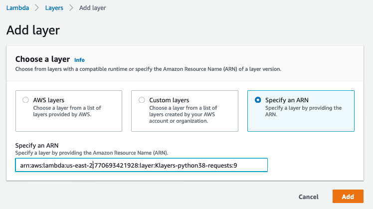
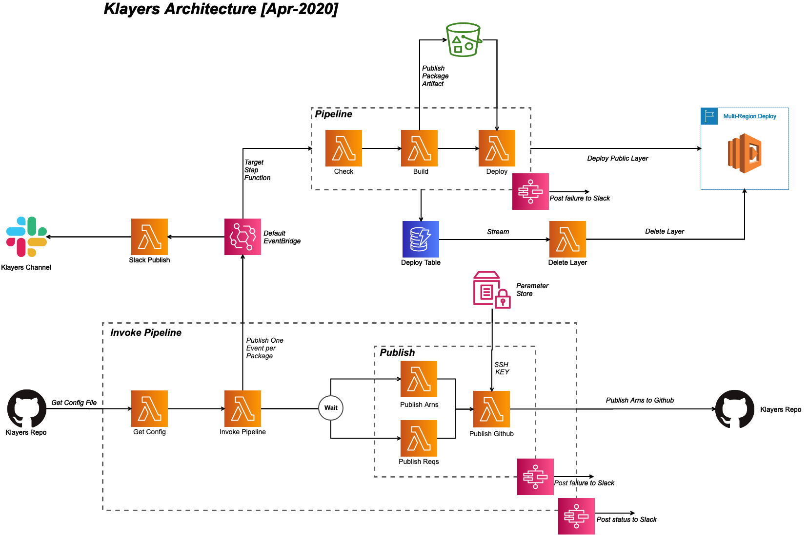

# Keith's Layers (Klayers)

🐍 A collection of Python Packages as AWS Lambda(λ) Layers 🐍

[](https://www.python.org/downloads/release/python-380/) [](https://lgtm.com/projects/g/keithrozario/Klayers/context:python) [](https://github.com/psf/black) 

## Layer List

List of all layer version arns are available by region [here](deployments/python3.8/arns)

There might be multiple versions for a single package, as we publish a new layer version if the package dependencies (`requirements.txt`) has been updated. Refer to [Layer expiry](#Layer-expiry) for more data.

*Note: We have deprecated layers for python3.6 and python 3.7, please use these newer versions that are built for python 3.8 going forward.*

## Python Packages

Just some examples of the ~70 packages we build every week, for a full list click [here](pipeline/config/Klayers-prodp38/packages.csv):

* aws-lambda-powertools
* aws-xray-sdk
* bcrypt
* beautifulsoup4
* boto3
* dynamodb-encryption-sdk
* idna
* lambda-cache
* nltk
* numpy
* opencv-python-headless
* openpyxl
* pandas
* parliament
* Pillow
* pulp
* pycryptodome
* PyJWT
* PyMUPDF
* pyqldb
* pytesseract
* pytz
* PyYAML
* requests
* slackclient
* spacy
* ...

## Status of layers

Click [here](https://pyup.io/repos/github/keithrozario/Klayers/) to see specific dependencies of all the latest builds. Layers are built with the latest package version at 2am UTC every Sunday.

## Using the Layers

You can use the layers anyway you see fit, here are 3 proposed options:

### Option 1: Set ARN as layer

Click links below for your preferred version of python, and then select your region of choice, you will see a full list of layer version ARNs to use.

* [Arns](deployments/python3.8/arns)

Once selected, you can add the arn directly from the console, by selecting Layers->Add a Layer->Specify an Arn:



### Option 2: Download copy of layer

Use the `Get Layer Version by ARN` in [python](https://boto3.amazonaws.com/v1/documentation/api/latest/reference/services/lambda.html#Lambda.Client.get_layer_version_by_arn) or [aws-cli](https://docs.aws.amazon.com/cli/latest/reference/lambda/get-layer-version-by-arn.html) command which will provide an S3 location to download the layer as a zip.

*Note: You can only get layers from the specific region your client is configured for, otherwise you'll get a `AccessDeniedException` error.*

### Option 3: Using Serverless Framework

You can include layers in your deployments, by utilizing the `layers` property at the function level, and setting it to the arn of your choice. You must use layers from the same region as your function:

```yaml
check:
  handler: 02_pipeline/check.main
  description: Checks for package on PyPi via the API
  runtime: python3.8
  timeout: 30
  memorySize: 256
  layers:
  - arn:aws:lambda:${self:provider.region}:113088814899:layer:Klayers-python37-packaging:1
  - arn:aws:lambda:${self:provider.region}:113088814899:layer:Klayers-python38-aws-lambda-powertools:23
```

## Layer expiry

Some layer versions will have a `expiry_date` field. This is the date for when the layers will be deleted.

In general, layers are scheduled for deletion 60 days after a new layer version has been published for that package. If you use that latest version of a layer, you're guaranteed at least 60 days before the layer is deleted.

All functions deployed with a layer will still work indefinitely, but you won't be able to deploy new functions referencing a deleted layer version.

## Binaries

Special hand-crafted binaries for layers. These layers are not automatically built, and hence slower update cycles, and will only work with python3.7 functions as the underlying OS is Amazon Linux 1.

| Package        | ARN                                                                             | Version    |
| :------------- |:------------------------------------------------------------------------------- | ---------- |
| pip            | arn:aws:lambda:\<*region*>:113088814899:layer:Klayers-python37-pip:2            | 19.2.1 <sup>1</sup>|     |
| en_core_web_sm | arn:aws:lambda:\<*region*>:770693421928:layer:Klayers-python38-spacy_model_en_small:1 | 2.2.5 <sup>2</sup>|
| es_core_news_sm | arn:aws:lambda:\<*region*>:770693421928:layer:Klayers-python38-spacy_model_es_small:1 | 2.3.1 <sup>2</sup>|

<sup>1</sup> Python3.8 layers already have new version of pip, use only if on Python3.7

<sup>2</sup> Spacy [en_core_web_sm](https://spacy.io/models/en) model, for use with the spacy layer refer [here](https://github.com/keithrozario/Klayers/issues/97) for more info.


## Architecture Diagram



## API (beta)

We've recently added an API under beta. All API calls are http-based, and work only with https (TLS1.2 and above). The API is heavily cached, so there could be minor delays in updates.

### Get latest ARN for specific package in region

Returns data on the latest layer for a specific *{package}* in a specific *{region}*

*https://api.klayers.cloud/api/v1/layers/latest/{region}/{package}*

example:

  * https://api.klayers.cloud/api/v1/layers/latest/us-east-1/requests
  * https://api.klayers.cloud/api/v1/layers/latest/ap-southeast-1/boto3


### Get all ARNs for specific package in region

Returns data on the all layers (latest and deprecated) for a specific *{package}* in a specific *{region}*

*https://api.klayers.cloud/api/v1/layers/{region}/{package}*


example:

  * https://api.klayers.cloud/api/v1/layers/us-east-1/requests
  * https://api.klayers.cloud/api/v1/layers/ap-southeast-1/boto3

### Get list of all built packages

Returns list of all packages currently being built, including dependencies and build date.

*https://api.klayers.cloud/api/v1/builds/latest*

example:
  
  * https://api.klayers.cloud/api/v1/builds/latest

## Special Thanks

* [Chahna107](https://github.com/chahna107) for adding tesseract config files into the tesseract layer.
* [~ Dependencies scanned by PyUp.io ~](https://pyup.io/)

## Asking for additional layers

If you would like a new package to be made a layer, raise a `pull request` modifying the `pipeline/config/Klayers-prodp38` file. 